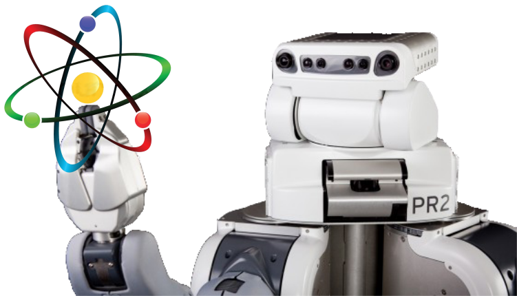
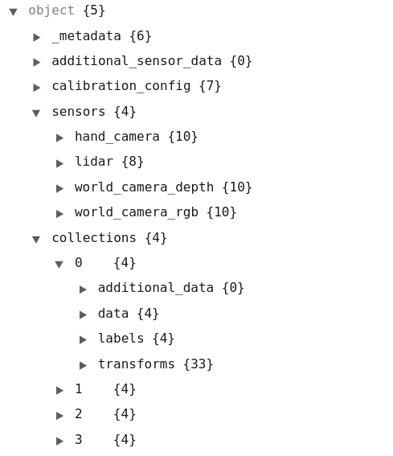
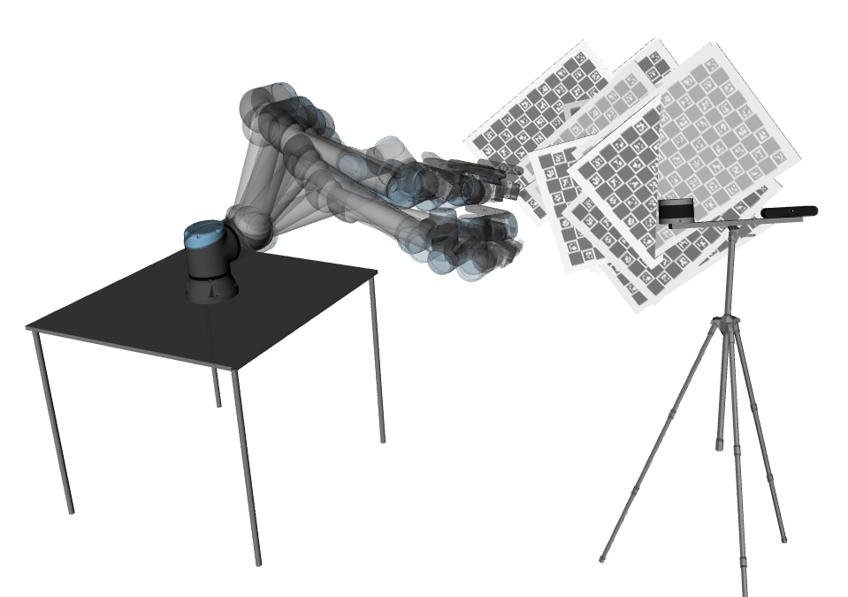

<figure markdown align=center>
  {width="60%" }
  <figcaption align=center></figcaption>
</figure>

## ATOM

  - [What is ATOM?](#what-is-atom)
  - [Calibration Pipeline](#calibration-pipeline)
    - [Robotic System Configuration](#robotic-system-configuration)
    - [Data Logging](#data-logging)
    - [Initial Positioning of Sensors](#initial-positioning-of-sensors)
    - [Data Collection and Labeling](#data-collection-and-labeling)
    - [Dataset playback](#dataset-playback)
    - [Calibration](#calibration)
    - [Calibration Evaluation](#calibration-evaluation)
    - [Running the calibrated system](#running-the-calibrated-system)
  - [What is a collection?](#what-is-a-collection)
  - [What is an ATOM Dataset?](#what-is-an-atom-dataset)

### What is ATOM?

[ATOM](https://github.com/lardemua/atom) is a calibration framework using the **A**tomic **T**ransformations **O**ptimization **M**ethod. 

<a href="https://github.com/lardemua/atom">https://github.com/lardemua/atom</a>

It contains a set of calibration tools for multi-sensor, multi-modal, robotic systems, based on the optimization of atomic transformations, as provided by a [ROS](https://www.ros.org/) based robot description. Moreover, it provides several scripts to facilitate all the steps of a calibration procedure.

<!--  -->

If this work is helpful for you please cite [our publications](acknowledgment.md#citing-atom).

### Calibration Pipeline

In order to calibrate a robotic system one needs to carry out several tasks, such as acquiring data, labeling data, executing the calibration, interpreting the result of the calibration, etc.
ATOM provides several scripts to address all the stages of a calibration procedure. 
These scripts are seamlessly integrated into [ROS](https://www.ros.org/), and makes use of [RViz](http://wiki.ros.org/rviz) to provide extensive visualization in severall stages of the calibration procedure.
We have divided the calibration procedure into several stages, shown in the scheme below.

<figure markdown align=center>
  {width="80%" }
  <figcaption align=center>ATOM calibration pipeline.</figcaption>
</figure>

The greyed out boxes  are steps considered to be out of the scope of ATOM, i.e., these are tasks one should do in order to configure a robot system in ROS. Dashed line boxes represent steps which are optional. They may be skipped if there is confidence that they are not required.

Below we describe each of these stages, giving examples for the [MMTBot](examples.md#mmtbot).

#### Robotic System Configuration 

 Robotic System Configuration concerns the design and implementation of your robotic system in ROS. It generally involves the writting of an [UDRF](http://wiki.ros.org/urdf) or a [xacro](http://wiki.ros.org/xacro) file that describes the links and joints of your robotic system. It sometimes also includes de configuration of a simulation of your system in [Gazebo](https://gazebosim.org/home).

Tipically one creates a couple of ros packages for our robot, as described below.

**<my_robot\>_description** ros package contains the xacro files that describe your robot. It sometimes also contains cad models inside a models folder. An example from [MMTBot is here](https://github.com/miguelriemoliveira/mmtbot/tree/main/mmtbot_description).

**<my_robot\>_bringup** ros package contains the launch files used to bringup your robotic system. Tipically there is a **bringup.launch** that starts the complete system.
An example from the [MMTBot](https://github.com/miguelriemoliveira/mmtbot/blob/main/mmtbot_bringup/launch/bringup.launch).

#### Data Logging

Data Logging is the procedure by which a [ros bagfile](http://wiki.ros.org/Bags) is recorded to be used in the calibration later on.

You may record data by [calling rosbag record](http://wiki.ros.org/rosbag/Tutorials/Recording%20and%20playing%20back%20data) directly, e.g.:

    rosbag record /topic1 ... /topicN -o output.bag

We tipically have a roslaunch file to record data and produce a bagfile for each robotic system. Here's the example for [MMTBot](https://github.com/miguelriemoliveira/mmtbot/blob/main/mmtbot_bringup/launch/record.launch).

A bagfile should contain several topics, namely transformations and joint state messages, as well as messages produced by the sensors in the system. For example, in the case of MMTBot, which has sensors **world_camera**, **hand_camera** and **lidar**, we record the following topics:

   - /tf
   - /tf_static
   - /joint_states
   - /world_camera/rgb/image_raw/compressed
   - /world_camera/rgb/camera_info
   - /hand_camera/rgb/image_raw/compressed
   - /hand_camera/rgb/camera_info
   - /lidar/points

#### Initial Positioning of Sensors

The goal of this stage is to allow the user to define interactively the poses of each sensor, so that the optimization starts close to the optimal solution and thus avoids local minima. 
This stage may be skiped in the transformations from the URDF are believed to be "more or less" accurate.

More details [here](procedures.md#set-an-initial-estimate).

#### Data Collection and Labeling

This stage reads the bagfile and allows the user to assist the labeling procedure, i.e., the identification of the calibration pattern in the data of the sensors, and then to decide when to save each collection. The output is an [ATOM dataset](#what-is-an-atom-dataset).

More details [here](procedures.md#collect-data).

#### Dataset playback

This stage is used to review ATOM datasets. The reviewing may identify incorrect labels, which can be corrected through manual annotation. It produces a corrected [ATOM dataset](#what-is-an-atom-dataset).

 More details [here](procedures.md#dataset-playback).

#### Calibration

This is were finally the system is calibrated. ATOM provides extensive visualization funcionalities so that it is possible to observe how the calibration is performing.

More details [here](procedures.md#calibrate).

#### Calibration Evaluation

ATOM provides several scripts designed to measure the accuracy of the calibration. 
These tools are pairwise evaluations, which means it is possible to compare the accuracy of ATOM with other state of the art pairwise approaches.

More details [here](evaluations.md).

#### Running the calibrated system

After calibration ATOM produces a calibrated URDF file which can be direcly used in ROS.

If you get here unscathed you are a very lucky person ... Enjoy!

### What is a collection?

A collection is a recording of the data from all the sensors in the system at a particular time instant selected by the user. Collections also contain information about labels for the sensor data, as well as the state of the robotic system at that time, i.e., all the transformations.

### What is an ATOM Dataset?

An ATOM dataset is a folder which contains data used for the calibration of a robotic system. Every ATOM dataset contains a **dataset.json** which provides details about the dataset, such as the defined configuration, the number of sensors, etc. 

Several scripts in the calibration pipeline require an ATOM dataset, but is worth mentioning that the files are also human readable. 

Below you can see the structure of an ATOM dataset.

<figure markdown align=center>
  {width="60%" }
  <figcaption align=center>Structure of an ATOM dataset json file.</figcaption>
</figure>

A **dataset.json** file contains a **_metadata** field, where details about the date, user and others are stored. It also contains a **calibration_config**, which is a copy of the state of the configuration file at the time of creation of the dataset. The **sensors** field describes each of the sensors in the system, in particular those selected to be calibrated. 

Finally, the **collections** field contains several collections, i.e. snapshots of data. Each collection contains a subfield **data**, that stores a dictionary obtained through the [conversion of the ROS message to a python dictionary](http://wiki.ros.org/rospy_message_converter), the subfield **labels** contains information about annotations (automatic or manual) of each sensor data, and the subfield **transforms** contains all the transformations published at (or near) the time of the collection.

In addition to the **dataset.json** file, ATOM datasets also contain dedicated files for larger data blobs, such as point clouds or images are saved separately in the same folder.

Because the transformations are stored for each collection, it is possible recover the complete state of the robotic system at the time of each collection. Below we view the different poses of the manipulator and the calibration pattern for each collection.

<figure markdown align=center>
  {width="90%" }
  <figcaption align=center>Several collections in an MMTBot dataset.</figcaption>
</figure>
